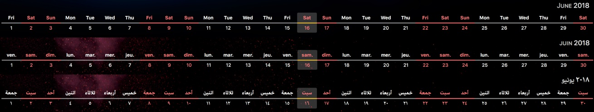
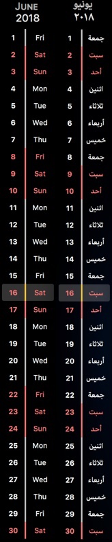

## Strip Calendar ##

An [Übersicht widget](http://tracesof.net/uebersicht-widgets/) that displays a calendar in a strip that...

* can be displayed in a horizontal or vertical orientation
* can present the information in any locale available in Javascript e.g. en-GB, ar-AS etc.
* provides support for a nine day fortnight

This widget is based on the [widget](https://github.com/ashikahmad/horizontal-calendar-widget) from ashikahmad but converted to Coffeescript and with the extra functionality listed above.

### Nine Day Fortnight ###

If you work a nine day fortnight as I do, where I get every other Friday off, then set `nineDayFortnightStartDay` to the date of a day in the calendar that is a day off e.g. `new Date(2017, 4, 12)`, then any dates a multiple of 14 days after that date will be shown as an off day.

### Horizontal Calendar ###

### Vertical Calendar ###

### License ###

[CC0 1.0 Universal](./LICENSE)